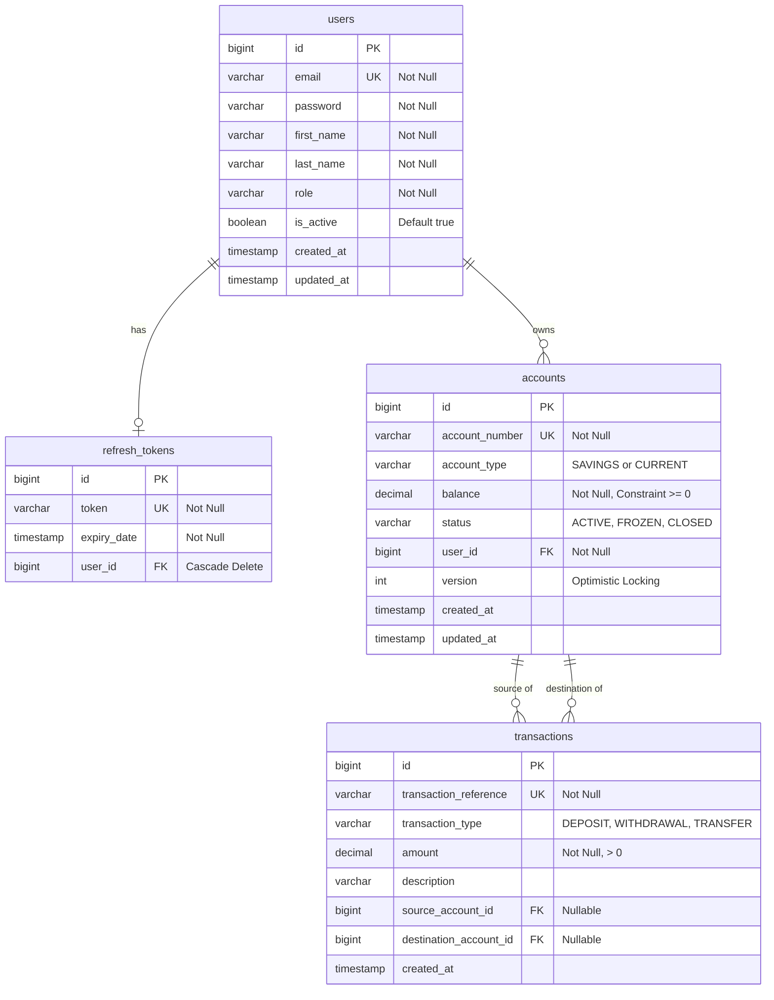

# Vault Bank - Online Banking System

**Vault Bank** is a production-quality, secure, and event-driven online banking system built using **Spring Boot 3.x**, **Spring Security**, **Apache Kafka**, and **MySQL**. The project is designed following Clean Architecture/Layered Architecture patterns and SOLID design principles...

---

## 🚀 Key Features

*   **Secure Authentication**: Stateful JWT access token authentication paired with Refresh Token Rotation (RTR) and logout-based session revocation.
*   **Account Lifecycle Management**: Supports Savings and Current account creation with unique 12-digit account number generation.
*   **Robust Transaction Engine**: atomic deposits, withdrawals, and peer-to-peer transfers protected by database-level constraints and Optimistic Concurrency Control.
*   **Asynchronous Event Backbone**: Event-driven decoupled flows publishing transaction events to Apache Kafka, consumed in parallel by simulated Audit Logs and Notification dispatch services.
*   **Premium Fintech UI Dashboard**: A handcrafted, single-page application built with Plus Jakarta Sans typography, featuring collapsible Lucide sidebars, dual dark/light themes, glowing virtual credit cards, visual Chart.js analytics, skeleton loaders, and interactive toast alerts.
*   **Administrative Dashboard Interfaces**: Features paginated user listings and instant account freeze/unfreeze administrative overrides.
*   **OpenAPI Documentation**: Automatically generated REST api docs using Swagger UI.

---

## 🛠 Tech Stack

*   **Language & Core**: Java 17, Spring Boot 3.2.5
*   **Security & Auth**: Spring Security 6, JSON Web Tokens (JJWT 0.11.5), BCrypt
*   **Persistence**: Spring Data JPA (Hibernate), MySQL 8.0
*   **Messaging**: Spring Kafka, Apache Kafka (KRaft mode)
*   **Frontend UI**: Plus Jakarta Sans, Lucide Icons, Chart.js, Vanilla CSS & HTML5
*   **APIs & Testing**: Springdoc OpenAPI (Swagger UI), JUnit 5, Mockito
*   **Orchestration**: Docker & Docker Compose

---

## 📐 Architecture & Package Layout

The codebase follows a strictly decoupled layered architecture. Controller mappings rely entirely on **DTOs (Data Transfer Objects)** to separate external serialization formats from internal JPA database schemas:

```
src/main/java/com/vaultbank/
├── VaultBankApplication.java
├── config/             # Security, Kafka, and Swagger Configurations
├── controller/         # REST API Controllers (ResponseEntity endpoints)
├── service/            # Core business contracts
│   ├── impl/           # Business implementations containing @Transactional logic
├── repository/         # Spring Data JPA MySQL repositories
├── entity/             # JPA Relational Entities & Auditable base schemas
├── security/           # JWT Filter, UserPrincipal, CustomUserDetailsService
├── consumer/           # Decoupled Kafka Consumers (Audit, Notification)
├── dto/                # Request, Response, and Kafka Event payloads
└── exception/          # Centralized Exception schemas & GlobalExceptionHandler
```

---

## ⚙️ How It Works (Deep Dive)

### 1. Concurrency Safety (Double-Spending Prevention)
Financial accounts are highly sensitive to concurrent write mutations (e.g. initiating two concurrent withdrawals simultaneously). To prevent race conditions:
- The `Account` entity implements JPA versioning (`@Version`). 
- When two transactions read and attempt to modify the same account balance, the first write commits successfully, incrementing the version. The second transaction immediately fails upon comparison, throwing a Spring `OptimisticLockingFailureException`.
- The `GlobalExceptionHandler` intercepts this error and translates it into a clean, localized HTTP 409 Conflict JSON response.

### 2. Session Integrity & Token Revocation
- **Access Tokens**: Short-lived (e.g. 15 minutes), containing the user's role and email claims.
- **Refresh Token Rotation (RTR)**: Long-lived (e.g. 7 days). Each time a client requests a new access token using `/api/auth/refresh`, the database rotates the refresh token. The old refresh token is revoked/replaced, and a new one is returned. This prevents token replication hijacking.
- **Logouts**: Deletes the user's refresh token record from the database, instantly blocking subsequent session continuation.

### 3. Decoupled Pub-Sub (Event-Driven Side-Effects)
When a transaction succeeds:
1. The `TransactionService` saves the records to the database.
2. It publishes an event (e.g. `DepositEvent`, `TransferEvent`) to the designated Kafka topic (e.g. `vault-bank.money-deposited`).
3. Core transactions complete without waiting for notifications or audit writes.
4. Two distinct consumer groups (`vault-bank-audit-group` and `vault-bank-notification-group`) process the events asynchronously in parallel.
5. **Partition Keying**: All transaction events are published using the `accountNumber` as the Kafka routing key. This ensures message ordering is preserved for each account partition in Kafka.

---

## 🛢 Database Model



---

## 🛠 Setup & Execution Guide

### Prerequisites
Make sure you have installed:
- [Java 17 (JDK)](https://adoptium.net/temurin/releases/?version=17)
- [Maven](https://maven.apache.org/)
- [Docker Desktop](https://www.docker.com/products/docker-desktop/)

---

### Step 1: Spin up Backing Services
Launch MySQL and Apache Kafka using the provided Docker compose file:
```bash
docker compose up -d
```
Verify that they are running:
```bash
docker compose ps
```

---

### Step 2: Build & Verify Unit Tests
Compile and run the Maven unit tests:
```bash
mvn clean test
```
All unit tests should complete successfully:
```text
[INFO] Results:
[INFO] Tests run: 12, Failures: 0, Errors: 0, Skipped: 0
[INFO] BUILD SUCCESS
```

---

### Step 3: Run the Spring Boot Server
Start the backend application:
```bash
mvn spring-boot:run
```
The server starts listening on **http://localhost:8081**.

---

### Step 4: Access the Premium Web UI Dashboard
Open your browser and navigate to:
👉 **[http://localhost:8081](http://localhost:8081)**

---

### Step 5: Interact via Swagger UI Documentation
Open your browser and navigate to:
**[http://localhost:8081/swagger-ui/index.html](http://localhost:8081/swagger-ui/index.html)**

#### Sample API Workflows:

1.  **Register a User**:
    *   Endpoint: `POST /api/auth/register`
    *   Payload:
        ```json
        {
          "email": "jane.doe@vaultbank.com",
          "password": "securepassword",
          "firstName": "Jane",
          "lastName": "Doe",
          "role": "ROLE_USER"
        }
        ```
    *   Copy the `accessToken` from the returned JSON.

2.  **Authorize your Client**:
    *   Click **Authorize** at the top right of the Swagger UI dashboard.
    *   Paste the token (e.g. `eyJhbG...`) into the text box and click **Authorize**.

3.  **Open an Account**:
    *   Endpoint: `POST /api/accounts`
    *   Payload:
        ```json
        {
          "accountType": "SAVINGS"
        }
        ```
    *   Execute the request and copy the generated 12-digit `accountNumber` (e.g. `934271830291`).

4.  **Deposit Cash**:
    *   Endpoint: `POST /api/transactions/deposit`
    *   Payload:
        ```json
        {
          "accountNumber": "934271830291",
          "amount": 2500.00,
          "description": "Initial Cash Deposit"
        }
        ```
    *   Look at your server command-line console to observe asynchronous Kafka consumer group notifications.

5.  **Admin Override (Account Freezing)**:
    *   Log in as an administrator (Register a user using `"role": "ROLE_ADMIN"`).
    *   Obtain and authorize using the admin access token.
    *   Endpoint: `POST /api/admin/accounts/{accountNumber}/freeze`
    *   Attempts to debit/transfer money from this account will now throw an `AccountFrozenException` (HTTP 400).
=======
